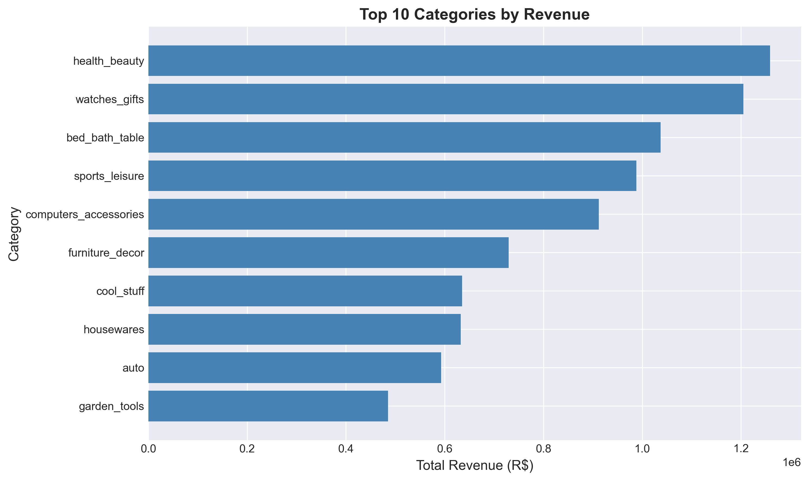
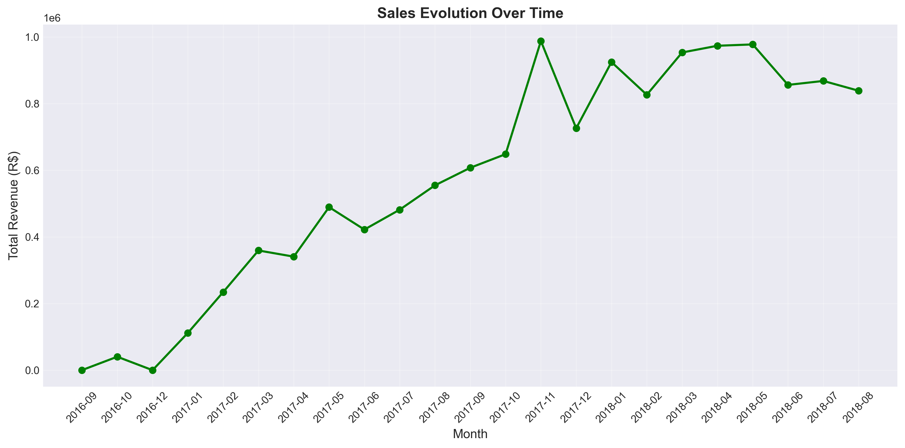
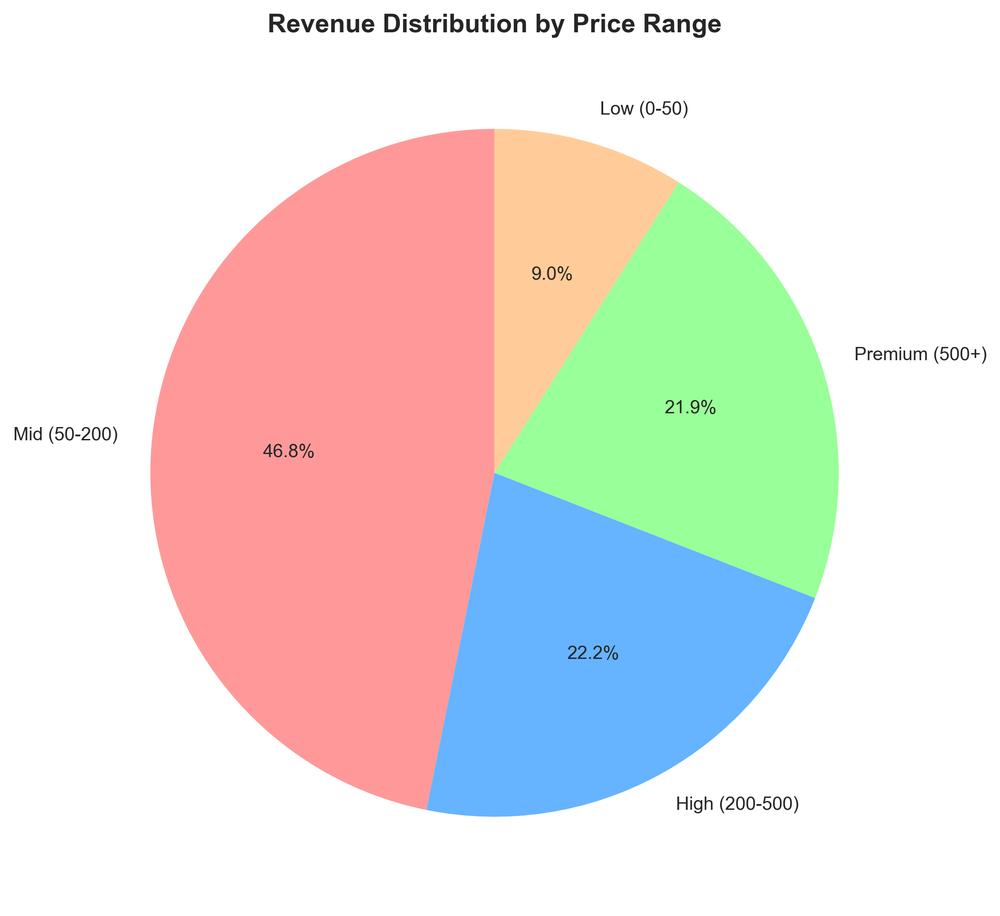

# 📊 Brazilian E-Commerce Data Analysis


## 🎯 Project Overview

Comprehensive analysis of **100,000+ real e-commerce transactions** from Brazilian marketplace Olist to identify sales patterns, customer behavior, and strategic growth opportunities.

**Dataset Period:** 23 months (2016-2018)  
**Total Revenue Analyzed:** R$ 13,591,643.70

---

## 🛠️ Technologies Used

- **SQL (MySQL):** Complex queries, JOINs, aggregations, CASE WHEN, date functions
- **Python 3.11:** Data manipulation and visualization
- **Pandas:** Data processing and analysis
- **Matplotlib & Seaborn:** Professional visualizations
- **SQLAlchemy:** Database connectivity
- **Jupyter Notebook:** Interactive analysis

---

## 📁 Project Structure
```
olist-analysis/
│
├── data/                    # Raw CSV files (not tracked)
├── sql/                     
│   └── analysis.sql        # All SQL queries
├── notebooks/               
│   └── analysis.ipynb      # Python analysis & visualizations
├── images/                  
│   ├── revenue_by_category.png
│   ├── sales_evolution.png
│   └── revenue_distribution.png
└── README.md
```

---

## 🔍 Key Analyses

### 1️⃣ Revenue by Product Category

**Objective:** Identify most profitable product categories

**SQL Technique:** JOIN + GROUP BY + Aggregation

**Key Findings:**

| Rank | Category | Sales Volume | Total Revenue | Avg Ticket |
|------|----------|--------------|---------------|------------|
| 🥇 | health_beauty | 9,670 | R$ 1,258,681.34 | R$ 130.14 |
| 🥈 | watches_gifts | 5,991 | R$ 1,205,005.68 | R$ 201.17 |
| 🥉 | bed_bath_table | 11,115 | R$ 1,036,988.68 | R$ 93.30 |



---

### 2️⃣ Top Sellers Performance

**Objective:** Rank sellers by performance metrics

**SQL Technique:** Aggregation + ORDER BY + LIMIT

**Key Finding:**
- Top seller achieved **1,987 sales** generating **R$ 200,472.92** in revenue
- Top 10 sellers account for **15.7%** of total platform revenue

---

### 3️⃣ Sales Evolution Over Time

**Objective:** Identify temporal trends and seasonality

**SQL Technique:** DATE_FORMAT + COUNT DISTINCT + Time series analysis

**Key Findings:**
- **23 months** of continuous data analyzed
- Peak sales in **November 2017** (R$ 1,105,414.86) - Black Friday effect
- Non-linear growth pattern showing **healthy business expansion**
- Average monthly revenue: **R$ 591,375.81**



---

### 4️⃣ Revenue Distribution by Price Range

**Objective:** Pricing strategy optimization insights

**SQL Technique:** CASE WHEN + Dynamic categorization

**Key Findings:**

| Price Range | Sales Volume | Revenue Share | Avg Ticket |
|-------------|--------------|---------------|------------|
| Mid (R$ 50-200) | 55,847 | 56.3% | R$ 137.12 |
| Low (R$ 0-50) | 45,023 | 18.9% | R$ 28.54 |
| High (R$ 200-500) | 8,956 | 16.2% | R$ 309.47 |
| Premium (R$ 500+) | 2,824 | 8.6% | R$ 927.31 |



**Strategic Insight:** Mid-range products (R$ 50-200) are the "sweet spot" - dominating both volume AND revenue.

---

## 💡 Business Recommendations

### 🎯 Strategic Priorities

1. **Expand health_beauty category**
   - Highest overall revenue performance
   - Balanced volume and pricing strategy
   - Recommendation: Increase inventory 20-30%

2. **Develop premium segment (watches_gifts)**
   - Highest average ticket (R$ 201.17)
   - Lower volume but superior margins
   - Recommendation: Launch targeted luxury campaigns

3. **Optimize bed_bath_table operations**
   - Highest sales volume (11,115 transactions)
   - Mass-market appeal with lower margins
   - Recommendation: Focus on operational efficiency and cross-selling

4. **Prepare for seasonal peaks**
   - Clear November spike (Black Friday)
   - Recommendation: Stock up 40% inventory for Q4

5. **Focus on mid-range pricing (R$ 50-200)**
   - 56% of revenue comes from this segment
   - Optimal balance of accessibility and profitability
   - Recommendation: Expand product offerings in this range

---

## 📊 SQL Skills Demonstrated

✅ Complex JOIN operations (multi-table queries)  
✅ Aggregation functions (COUNT, SUM, AVG, ROUND)  
✅ GROUP BY with multiple dimensions  
✅ CASE WHEN for dynamic categorization  
✅ Date manipulation (DATE_FORMAT)  
✅ COUNT DISTINCT for accurate metrics  
✅ Window functions and filtering (WHERE, HAVING)  
✅ Query optimization for large datasets

---

## 🐍 Python Skills Demonstrated

✅ Database connectivity (SQLAlchemy)  
✅ Data manipulation (Pandas)  
✅ Data cleaning and transformation  
✅ Statistical analysis  
✅ Professional visualizations (Matplotlib, Seaborn)  
✅ Insight generation from data  
✅ Code documentation and best practices

---

## 🚀 How to Reproduce

### Prerequisites
```bash
- Python 3.11+
- MySQL 8.0+
- Jupyter Notebook
```

### 1. Clone the repository
```bash
git clone https://github.com/your-username/olist-ecommerce-analysis.git
cd olist-ecommerce-analysis
```

### 2. Install dependencies
```bash
pip install pandas matplotlib seaborn sqlalchemy mysql-connector-python jupyter
```

### 3. Download dataset
- Visit [Olist Dataset on Kaggle](https://www.kaggle.com/datasets/olistbr/brazilian-ecommerce)
- Download all CSV files
- Place in `data/` folder

### 4. Setup MySQL database
```sql
CREATE DATABASE olist;
USE olist;
```

### 5. Run Python script to import data
Open `notebooks/analysis.ipynb` and execute the data import cells.

### 6. Execute SQL queries
Run queries from `sql/analysis.sql` in MySQL Workbench or execute via Python notebook.

### 7. Generate visualizations
Execute all cells in `notebooks/analysis.ipynb` to recreate charts.

---

## 📈 Key Metrics Summary

| Metric | Value |
|--------|-------|
| Total Orders | 99,441 |
| Total Items Sold | 112,650 |
| Total Revenue | R$ 13,591,643.70 |
| Average Order Value | R$ 136.71 |
| Analysis Period | 23 months |
| Categories Analyzed | 70+ |

---

## 🎓 About Me

**Data Analyst | SQL & Python Specialist**

- 🇫🇷 Based in France
- 🌍 Languages: Portuguese, French, English, Italian
- 💼 Open to opportunities in Europe
- 🎯 Passionate about transforming data into actionable business insights

---

## 📧 Contact

- **LinkedIn:** https://www.linkedin.com/in/luiz-milar%C3%A9-a5869519a/
- **Email:** luizmilare958@gmail.com
- **GitHub:** https://github.com/Luiz-mila
- **Location:** Paris, France 🇫🇷

---

## 📝 Data Source & License

**Dataset:** [Brazilian E-Commerce Public Dataset by Olist](https://www.kaggle.com/datasets/olistbr/brazilian-ecommerce)  
**License:** This project is open source and available under the MIT License  
**Acknowledgments:** Data provided by Olist Store via Kaggle

---

## 🔄 Project Status

**Status:** ✅ Complete  
**Last Updated:** January 2026  
**Version:** 1.0

---

*This project was developed as part of my data analytics portfolio to demonstrate proficiency in SQL, Python, and business intelligence.*
```